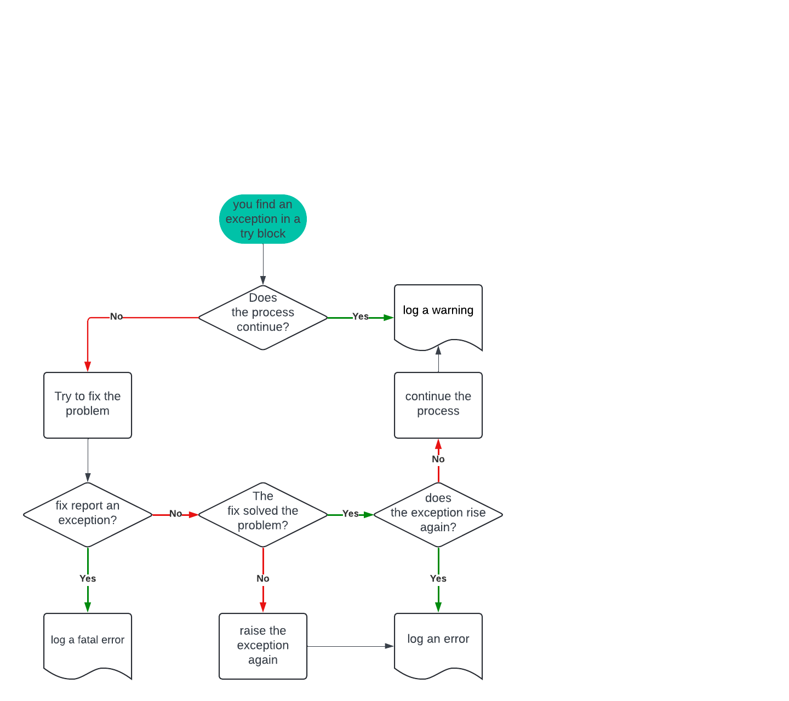

# DLAI

## How to install the repository

### Prerequisites

- **Operative system**: Linux Ubuntu 22.04 LTS (Jammy Jellyfish)
- **Python3**: 3.10.12
- **git-all**: installed

No administrator privileges needed.

#### Check prerequisites
~~~bash
cat /etc/os-release  # Linux release

python3 --version  # current python version
# if python version is not 3.10.12 install pyenv:
sudo apt update
sudo apt install -y make build-essential libssl-dev zlib1g-dev \
libbz2-dev libreadline-dev libsqlite3-dev wget curl llvm \
libncurses5-dev libncursesw5-dev xz-utils tk-dev libffi-dev \
liblzma-dev python3-openssl git
curl https://pyenv.run | bash
# follow procedure at the end of installation and restart the terminal
# install a new version of python with pyenv:
pyenv install 3.10.2
pyenv local 3.10.2

git --version  # check if git-all is installed
# if git-all there isn't in your system:
sudo apt-get install git-all
~~~

### Install the repository

- Find the path of the python3 command (for example: "/usr/bin/python3")
- Download the repository in the current directory:
~~~bash
    git clone https://github.com/StefanoMagriniAlunno/DLAI
    cd DLAI
~~~
- Set the current branch and install:
~~~bash
    git checkout your_branch
    ./install.sh /path/of/python3.10.12
~~~

It took longer than expected. ☕

## Repository contents

The master repository contains a basic template for hypothetical projects. It has two source folders:
- **sources**: This folder contains the first script, main.py, and a common module.
- **builds** and **libs**: These folders contain the source C code for shared objects.

In **assets**, we find images for this README and other graphics scripts.
In **templates**, we find code templates used by scripts.

In **documents**, we find the project documentation.

### Tools and Tests

"Test" and "tools" are folders for organizing Python scripts. Tools are used to show or analyze data, while tests are used for simple programs or proofs.

### Source design
Source code is organized in modules in sources and Python can call shared objects in libs. Each shared object is made from a single C project in builds. In brief: module organization in sources and sparse organization in builds.
Run make to refresh the list of shared objects.

### Handle scripts
This repo uses four scripts to manage libraries and modules:
- **add_lib.sh**: add a library template in builds
- **add_mod.sh**: add a module template in sources
- **rem_lib.sh**: remove a library from builds
- **rem_mod.sh**: remove a module from sources
- **history.log**: shows all actions with scripts.

### tasks.py
This file is a template for new branches. It installs packages and downloads data from the web during installation.
When yoy modify tasks.sh please reinstall the repository using **reinstall.sh**

## pre-commit
This repository uses a pre-commit system to manage updates:
1. **end-of-file-fixer --autofix**
2. **mixed-line-ending**
3. **check-yaml**
4. **check-json**
5. **check-docstring-first**
6. **sort-simple-yaml**
7. **pretty-format-json**
8. **flake8**
9. **doc8**
10. **autoflake**
11. **isort**
12. **shellcheck --exclude=='^templates/|install\.sh$'**
13. **mypy**
14. **black**

To check your code without committing it, run:
~~~bash
    pre-commit run --all-files
~~~

### Simple manual for GitHub

~~~bash
git checkout repo_name  # --> change repository branch
git branch  # get the current branch
git status  # get the status of current branch

git add .  # add updates in a queue (add again to update the queue)
git commit -m "message..."  # start pre-commit over the added queue
# if you not pass the test, try again:
# > git add .
# > git commit -m "message..."

# il problem persists, manual fix is required.
# fix code and try again...
# > git add .
# > git commit -m "message..."

git pull  # github compare commit with current version of code and try to merge yuor updates
git push  # fix changes
~~~

## Logger policy

- All own objects has a base abstract class "LoggerSupport".
- All own objects accept in construction the logger as last one parameter called "log"
- Always call super().\_\_init\_\_(log) in \_\_init\_\_ and super().\_\_del\_\_(log) in \_\_del\_\_
- Report in documentation the personal exceptions
- Use own function with reported own exception in a "try block"
- Report the founded exception use the following decision tree:
 
- Report the exception case in message.
- If you rised a warning, report if you tried solve the problem: (ex. "Exception fixed")
- If you rised an error, report if fix solve the problem: "Exception solved"/"Exception unsolved"

Limit usage of exceptions using only exception of this list:
- AssertionError
- LookupError
- StopAsyncIteration
- ValueError
- Warning

Catch not own exception using Exception wrapper
