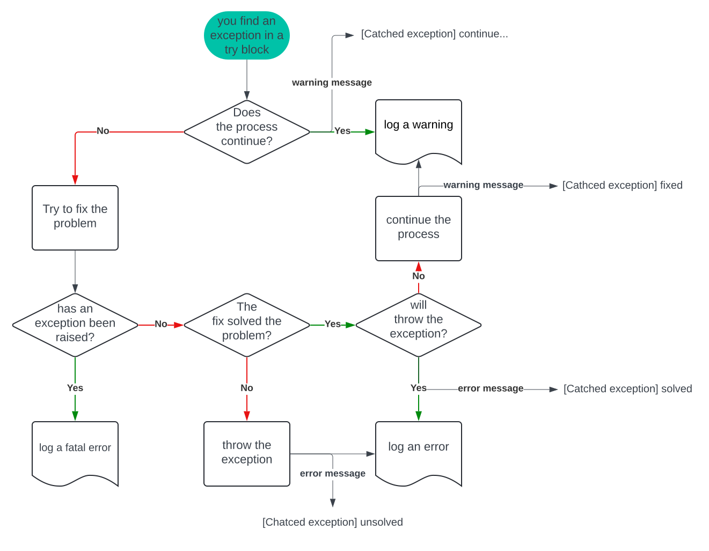

# DLAI

## How to install the repository

### Prerequisites

- **Operative system**: Linux Ubuntu 22.04 LTS (Jammy Jellyfish)
- **Python3**: 3.10.12
- **git-all**: installed

No administrator privileges needed.

#### Check prerequisites
~~~bash
cat /etc/os-release  # Linux release

python3 --version  # current python version
# if python version is not 3.10.12 install pyenv:
sudo apt update
sudo apt install -y make build-essential libssl-dev zlib1g-dev \
libbz2-dev libreadline-dev libsqlite3-dev wget curl llvm \
libncurses5-dev libncursesw5-dev xz-utils tk-dev libffi-dev \
liblzma-dev python3-openssl git
curl https://pyenv.run | bash
# follow procedure at the end of installation and restart the terminal
# install a new version of python with pyenv:
pyenv install 3.10.2
pyenv local 3.10.2

git --version  # check if git-all is installed
# if git-all there isn't in your system:
sudo apt-get install git-all
~~~

### Install the repository

- Find the path of the python3 command (for example: "/usr/bin/python3")
- Download the repository in the current directory:
~~~bash
    git clone https://github.com/StefanoMagriniAlunno/DLAI
    cd DLAI
~~~
- Set the current branch and install:
~~~bash
    git checkout your_branch
    ./install.sh /path/of/python3.10.12
~~~

It took longer than expected. ☕

## Repository contents

The master repository contains a basic template for hypothetical projects. It has two source folders:
- **sources**: This folder contains the first script, main.py, and a common module.
- **builds** and **libs**: These folders contain the source C code for shared objects.

In **assets**, we find images for this README and other graphics scripts.
In **templates**, we find code templates used by scripts.

In **documents**, we find the project documentation.

### Tools and Tests

"Test" and "tools" are folders for organizing Python scripts. Tools are used to show or analyze data, while tests are used for simple programs or proofs.

### Source design
Source code is organized in modules in sources and Python can call shared objects in libs. Each shared object is made from a single C project in builds. In brief: module organization in sources and sparse organization in builds.
Run make to refresh the list of shared objects.

### Handle scripts
This repo uses four scripts to manage libraries and modules:
- **add_lib.sh**: add a library template in builds
- **add_mod.sh**: add a module template in sources
- **rem_lib.sh**: remove a library from builds
- **rem_mod.sh**: remove a module from sources
- **history.log**: shows all actions with scripts.

### tasks.py
This file is a template for new branches. It installs packages and downloads data from the web during installation.
When yoy modify tasks.sh please reinstall the repository using **reinstall.sh**

## GitHub
### Good practice
Before starting an editing session, it is good practice to make sure that while you are not using the repository, no changes have already been made by other users.
~~~bash
    git pull
~~~
If there have been changes to the tasks.py or requirements.txt or install.sh files, it may be helpful, if not necessary, to reinstall the repository.
~~~bash
    ./resinstall.sh /path/of/python3.10.12
~~~

If you think the master branch has been changed and you have your own changes in the repository yet to be committed, try executing:
~~~bash
    git merge master
~~~
This command tries to integrate changes made in the master branch within the current branch. It is also possible to execute:
~~~bash
    git pull
~~~
However, this instruction attempts a merge of the entire current branch thus including files that do not pertain to the master branch.
If the union could not be resolved in a file, then an exclamation mark will appear and within it options as to which variant should be considered:
~~~python
    <<<<<<< yours:sample.txt
    Local version
    =======
    Ufficial version
    >>>>>>> theirs:sample.txt
~~~
In this case, it will be necessary to assess which of the two versions to choose on a case-by-case basis. Then open the official repository and examine the branch to see how the author of the changes to the master decided to resolve the inconsistencies. In case of doubt, contact the administrator of the master branch.

If there have been changes to the requirements.txt or install.sh files, it may be helpful, if not necessary, to reinstall the repository.
~~~bash
    ./resinstall.sh /path/of/python3.10.12
~~~

### Commit
If you want to submit your changes to github and compare them with the current public version of your branch run:
~~~bash
    git add .  # Consolidate all changes into a single, simple list of changes
    git commit -m "your message"  # Try to commit the changes
~~~

This repository uses a pre-commit system to manage updates:
1. **end-of-file-fixer --autofix**
2. **mixed-line-ending**
3. **check-yaml**
4. **check-json**
5. **check-docstring-first**
6. **sort-simple-yaml**
7. **pretty-format-json**
8. **flake8**
9. **doc8**
10. **autoflake**
11. **isort**
12. **shellcheck --exclude=='^templates/|install\.sh$'**
13. **mypy**
14. **black**

To check your code without committing it, run:
~~~bash
    pre-commit run --all-files
~~~

If you do not pass a pre-commit test then try again at least one more time:
~~~bash
    git add .
    git commit -m "your message"
~~~

If the second attempt still fails the tests, then look for the error in your code by following the pre-commit directions.

If all tests are passed then proceed with synchronization. Then compare the proposed changes with the currently official branch:
~~~bash
    git pull
~~~

Git will try to merge your current local branch with the public branch. If there are unresolved inconsistencies it will throw an alert and you will need to follow the directions to find the inconsistencies and resolve them manually.

If the update did not help or found no problems then you can proceed with sending the changes because the local repository can now merge with the official one.
~~~bash
    git push
~~~

### Other commands
~~~bash
    git branch  # show the current branch
    git status  # show the status of working tree (ex. commits, changes, merges ...)
~~~

## Logger policy

- All custom objects have a base abstract class "LoggerSupport".
- All custom objects accept the logger as last parameter in construction, called "log".
- Always call super().\_\_init\_\_(log) in \_\_init\_\_ and super().\_\_del\_\_(log) in \_\_del\_\_.
- Report the custom exceptions in the documentation
- Use your own function with your own reported exception in a "try block".
- Report the found exception using the following decision tree:
 .
- Report the exception in a message.
- If you rised a warning, report if you tried to solve the problem.
- If you rised an error, report if fix solve the problem.

Limit the use of exceptions by using only exceptions from this list:
- AssertionError
- LookupError
- StopAsyncIteration
- ValueError
- Warning

Catch other exceptions using Exception as a wrapper
